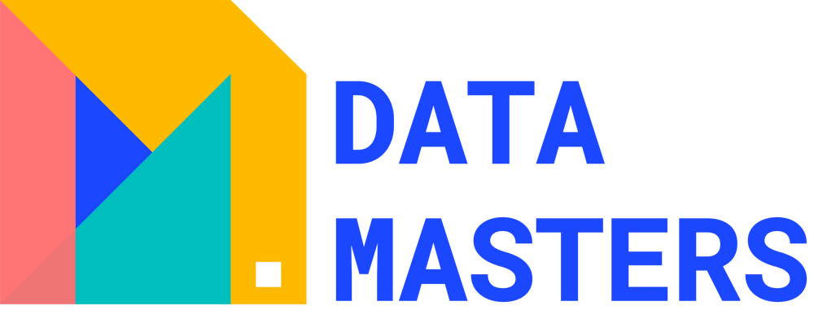

Benvenuti al Workshop per Beginners di [Data Masters](https://datamasters.it)! Il workshop pensato per introdurre neofiti e appassionati al linguaggio di programmazione Python.

## Get Started

**Notebooks**: 

[](https://mybinder.org/v2/gh/Datamasters-it/Gotta-Check-Them-All/main?labpath=Live_Coding.ipynb)
[ ](https://colab.research.google.com/github/Datamasters-it/Gotta-Check-Them-All/blob/main/Live_Coding.ipynb)

**Notebooks Completi**: 

[](https://mybinder.org/v2/gh/Datamasters-it/Gotta-Check-Them-All/main?labpath=Live_Coding_FULL.ipynb)
[](https://colab.research.google.com/github/Datamasters-it/Gotta-Check-Them-All/blob/main/Live_Coding_FULL.ipynb)

**Notebooks con Pandas**: 

[](https://mybinder.org/v2/gh/Datamasters-it/Gotta-Check-Them-All/main?labpath=Live_Coding_FULL_Pandas.ipynb)
[](https://colab.research.google.com/github/Datamasters-it/Gotta-Check-Them-All/blob/main/Live_Coding_FULL_Pandas.ipynb)

[**Slides Deck**]:(https://frankhood-my.sharepoint.com/:p:/g/personal/info_frankhood_onmicrosoft_com/Ed5gx77NS1pKgQqe6q-kMYwBGpgDpDZku6P1t0D_oc7Jwg?e=ceqGRf)

## Table of Content

- [About the workshop](#descr) 


### <a name="descr">Descrizione</a>

Durante il workshop lavoreremo su un progetto che vuole realizzare un innovativo [Motore di Ricerca](https://it.wikipedia.org/wiki/Motore_di_ricerca) per i **Pokémon**.

Tale motore di ricerca includerà una speciale e super segreta tecnologia in grado di identificare i `k` Pokémon più simili ad una data [_query di ricerca_](https://it.wikipedia.org/wiki/Information_retrieval).

Progetteremo e svilupperemo passo passo questa speciale tecnologia che avrà l'obiettivo di calcolare un punteggio di similirità tra Pokémon, sia esitenti che immaginari, identificati da un insieme di specifiche caratteristiche. 

🧑‍💻 **Happy coding!** 👩‍💻

#### Curioso di saperne di più? (⚠️  ATTENZIONE, SPOILER )

Lavoreremo insieme all'implementazione dell'algoritmo [KNN](https://it.wikipedia.org/wiki/K-nearest_neighbors), un popolare e semplice metodo di [Machine Learning](https://it.wikipedia.org/wiki/Apprendimento_automatico) pensato per misurare le distanze fra punti in spazi ad N dimensioni. 

Ogni `Pokémon` nel nosto insieme di dati sarà rappresentato dalle seguenti caratteristiche:

```
- HP
- Attacco
- Difesa
- Attacco Speciale
- Difesa Speciale
- Velocità
```

Obiettivo dell'algoritmo è quello di confrontare il valore di ciascuna di queste caratteristiche, e restituire i `k` pokémon _maggiormente simili_ (i.e. alternativamente, a minore distanza), dati i paramentri della _query di ricerca_.

🧑‍💻 **Happy coding!** 👩‍💻

#### Strumenti

Il codice sviluppato durante il workshop non farà uso di alcuno strumento o software di terze parti che non sia direttamente incluso nell'installazione del linguaggio Python.

[↑ Back to top](#table-of-content)
